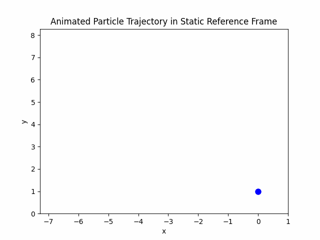
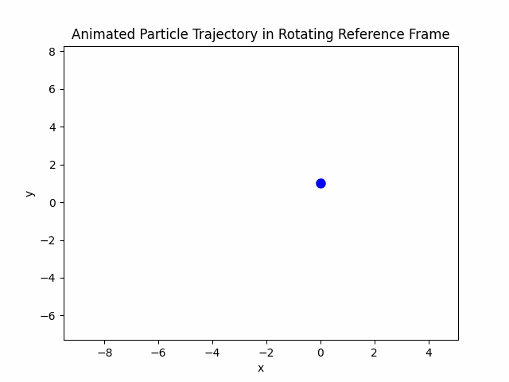
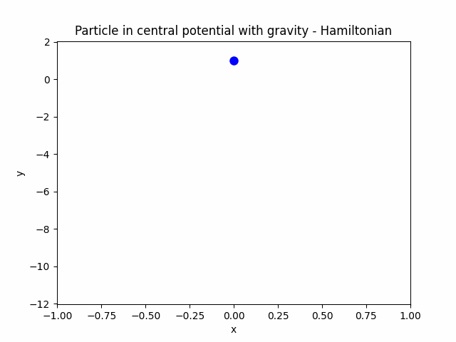
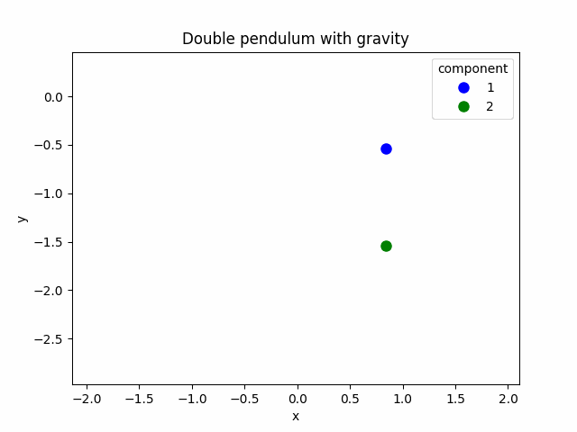
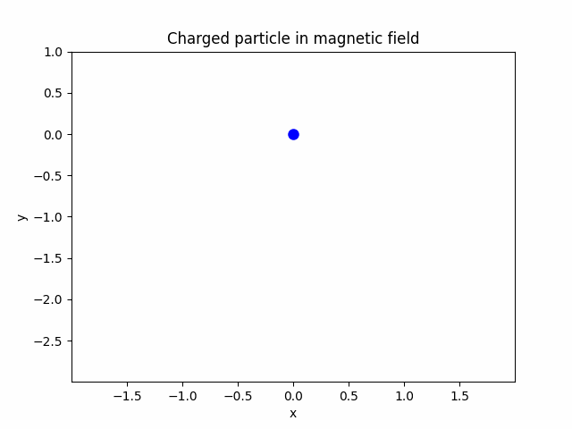

# Classical mechancis
> Classical mechanics examples discussed in the Leonard Susskind "Theoretical Minimum" lectures, plus the dome paradox.

Covered examples with links to their notebooks:

* [free particle in static / rotating reference frame](notebooks/0-free-particle.ipynb)
* [particle in central potential](notebooks/1-particle-central-potential.ipynb)
* [dome paradox](notebooks/2-particle-dome-paradox.ipynb)
* [double pendulum](notebooks/3-double-pendulum.ipynb)
* [charged particle in magnetic field](notebooks/4-charged-particle-in-magnetic-field.ipynb)

## Setup

    uv sync

## Trajectories

